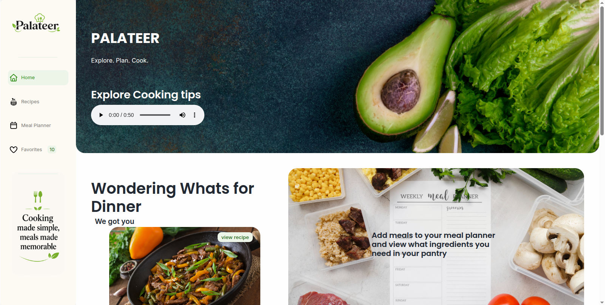
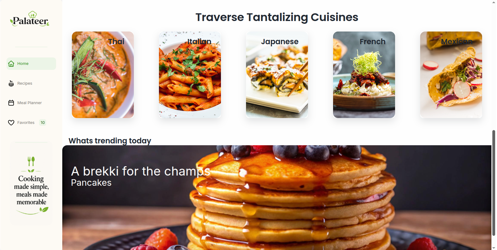
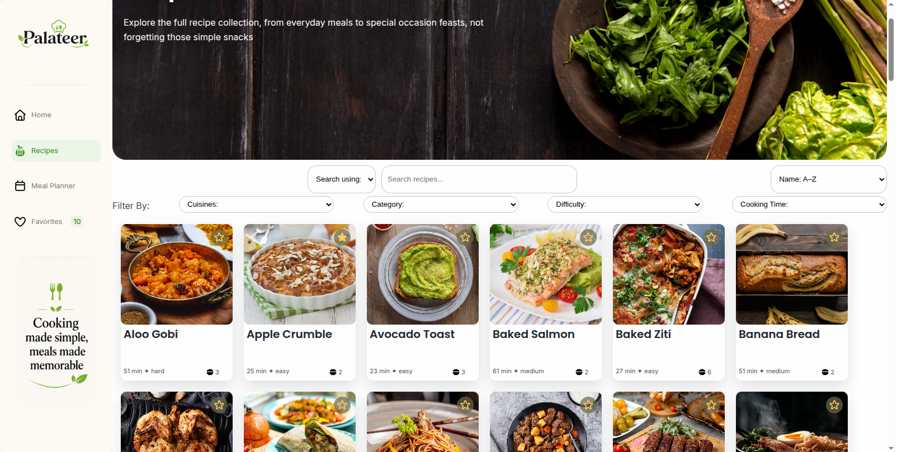
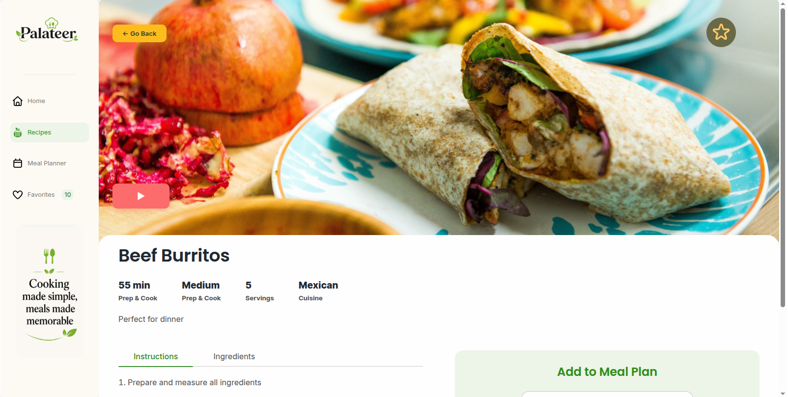
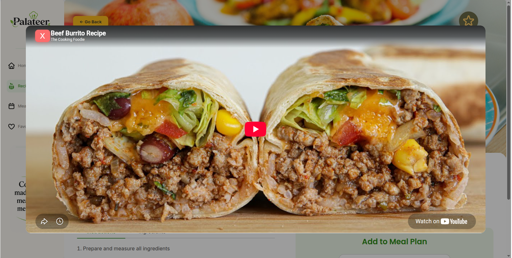
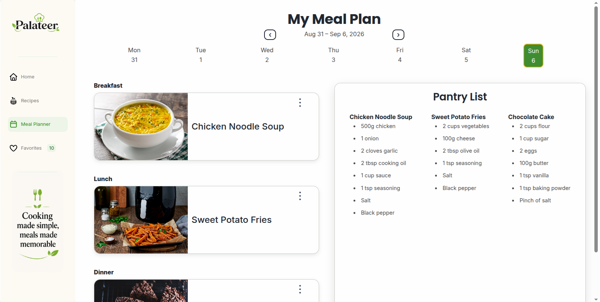
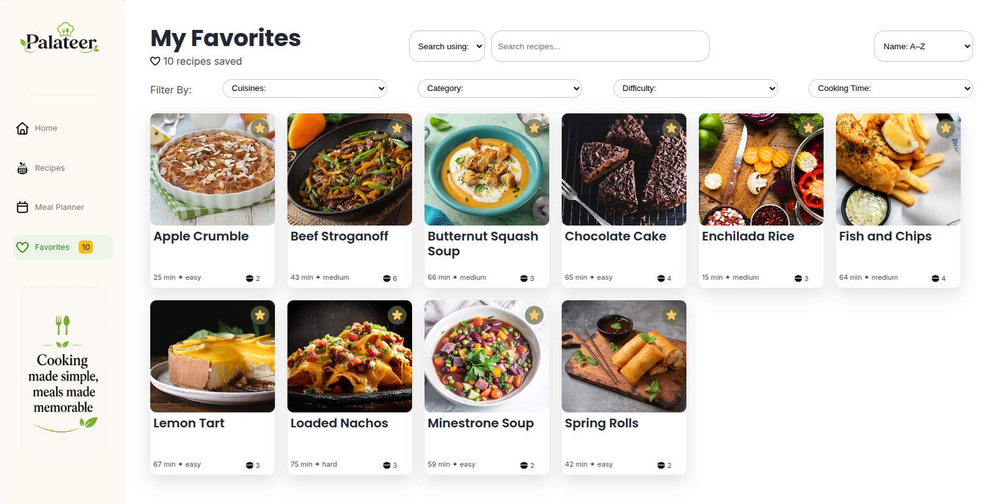
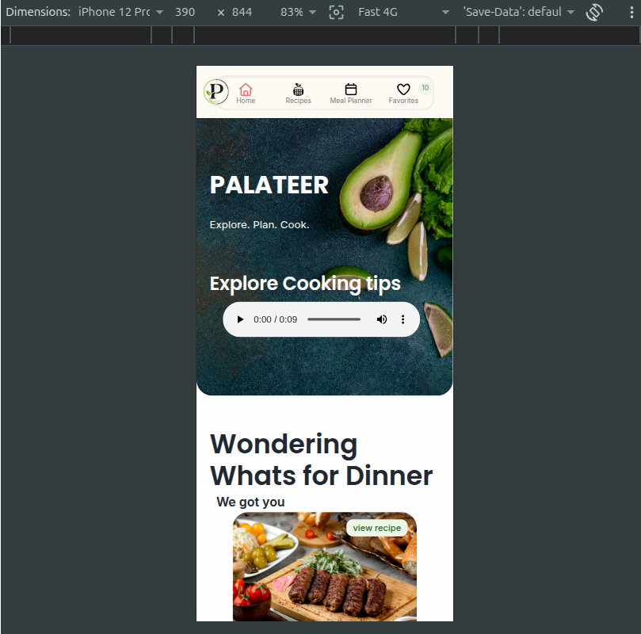

# Palateer — Recipe Discovery & Meal Planning App

## Explore. Plan. Cook.

[](https://bilodav.github.io/Palateer/)

For my Capstone 3 Project I have designed Palateer, which is a React single-page application built for a local cooking school. It allows users to browse a library of over 100 recipes, save favorites, and plan for a week of meals with an auto-generated shopping list too. I built the app using only functional components and hooks, and it demonstrates routing. Context-based state management, multimedia embedding, and CSS Modules styling.

## Features

- Browse over 100 sample recipes across breakfast, lunch, dinner, dessert and snacks
- Search by title or ingredient, sort by name, cook time, or difficulty and filter by cuisine,category,difficulty,and cook time.
- Recipe detail pages with an ingredient checklist and numbered instruction, an embedded video tutorial, and a randomized cooking-tip `<audio>` clip on the home page.
- Favorites, that can betoggled from any recipe card, persisted to `localStorage`, with a live count badge in nav.
- Weekly meal planner: A 7-day strip with breakfast, lunch and dinner slots, add/edit/delete meals via a modal form and an auto-generated shopping list per day that is persisted to `localStorage`.
- Fully responsive layout for mobile, tablet and desktop built on a shared color palette and typography scale.
- Custom 404 page.

## Tech stack

- React (functional components + hooks only, no class components)
- React Router DOM - client-side routing, including dynamic `:id` routes, programmatic navigation and a catch all 404 route
- PropTypes - runtime props validation
- CSS Modules - component-scoped styling
- Vite - build tooling and dev server
- Browser `localStorage` persistance
- React Context API(`FavoritesContext`, `MealPlannerContext`) for state thats shared across pages

## Installation

```bash
npm install
npm run dev      # start the local dev server (Vite, http://localhost:5173)
npm run build    # production build
npm run lint     # eslint
```

The app runs at `http://localhost:5173`

## Live Hosting

Click the link below to view a live preview without needing to download and install<br>
[Palateer](https://bilodav.github.io/Palateer/)

## Project structure

```
src/
├── components/
│   ├── context/        FavoritesContext, MealPlannerContext
│   ├── navigation/      Navbar
│   ├── recipe/           RecipeCard, RecipeList, RecipeDetail
│   ├── mealPlanner/       MealPlanner, DayCard, MealSlot, MealPicker, ShoppingList
│   ├── media/              VideoPlayer, AudioPlayer
│   ├── ui/                  Button, Card, SearchBar, FilterBar, Modal, Loader, Favorite, List, TabList
│
├── pages/                  Home, RecipesPage, RecipeDetailPage, MealPlannerPage, FavoritesPage, NotFound
├── data/                   recipesData.js (101 sample recipes)
├── utils/                  helpers.js (search/sort/filter, date, and localStorage helpers)
├── App.jsx, main.jsx
```

## Component overview

| Component                                                          | Purpose                                                                        |
| ------------------------------------------------------------------ | ------------------------------------------------------------------------------ |
| `Navbar`                                                           | Route links with active-route styling and a live favorites counter             |
| `RecipeCard` / `RecipeList`                                        | Recipe summary card and the grid that renders them                             |
| `RecipeDetail`                                                     | Full recipe view: ingredients, steps, video, and the meal-plan picker          |
| `SearchBar` / `FilterBar`                                          | Search-by/sort controls and multi-field filtering                              |
| `MealPlanner` / `DayCard` / `MealSlot` / `MealPicker`              | Weekly planner: week navigation, and per-slot add/edit/remove via a modal form |
| `ShoppingList`                                                     | Aggregates ingredients for a day's planned meals                               |
| `VideoPlayer` / `AudioPlayer`                                      | HTML5 media wrappers with loading/error states and fallback text               |
| `Button`, `Card`, `Modal`, `Loader`, `Favorite`, `List`, `TabList` | Reusable UI primitives                                                         |

## State management

Two pieces of app-wide state, favorites and the meal plan, live in React
Context (`FavoritesContext` and `MealPlannerContext`), each syncing to
`localStorage` via `useEffect`. Components call `useFavorites()` or
`useMealPlanner()` directly rather than receiving this data through props,
which keeps pages like Recipes, Favorites, and Recipe Detail in sync with
each other automatically without prop drilling. Everything else, search
text, filter/sort selections, active tab, modal visibility, is local
`useState` owned by the component that uses it, passed down as props with
callback props flowing back up for child-to-parent communication (e.g.
`SearchBar`/`FilterBar` call `onXChange` setters owned by their parent page).

## Routing

| Route           | Page                          |
| --------------- | ----------------------------- |
| `/`             | Home                          |
| `/recipes`      | Browse and filter recipes     |
| `/recipes/:id`  | Recipe detail (dynamic route) |
| `/meal-planner` | Weekly meal planner           |
| `/favorites`    | Saved recipes                 |
| `*`             | 404 Not Found                 |

## Screenshots

### Home




### Recipes with filters



### Recipe detail with video




### Meal planner



### Favorites



### Mobile view


